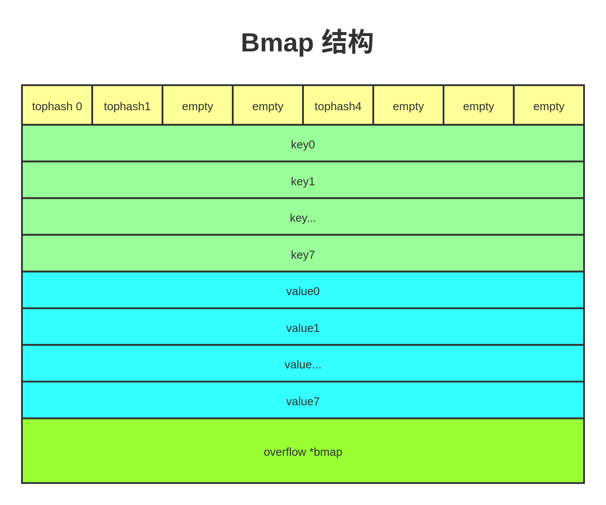
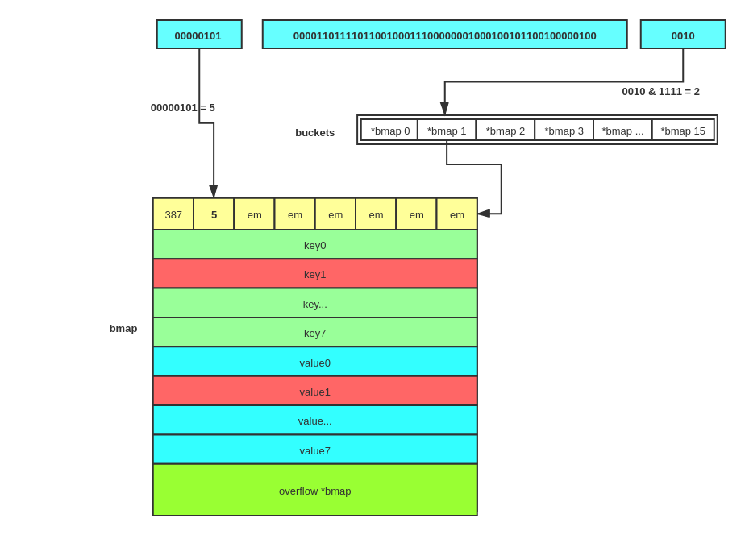

# go map

map结构是一种高频使用的数据结构，go的map是采用`链表法`（解决hash冲突的时候，落在相同hash结果的bucket采用链表连接）的hash table。

go map的源码的目录为go/src/runtime/map.go。本文基于go1.13的版本。map的底层数据结构其实是`hmap`的指针。
```go
type hmap struct {
	count     int // map的大小，len(map)返回的值
	flags     uint8 //状态flag 值有 1,2，4，8
	B         uint8  // bucket数量的对数值 例如B为5 则表明有2^5（32）个桶
	noverflow uint16 // 溢出桶（overflow buckets）的大概数量
	hash0     uint32 // hash seed
	buckets    unsafe.Pointer // 桶数组的指针，如果len为0，则指针为nil.
	oldbuckets unsafe.Pointer // 在扩容的时候这个指针不为nil
	nevacuate  uintptr        // progress counter for evacuation (buckets less than this have been evacuated)
	extra *mapextra // 当key和value都可内嵌的时候会用到这个字段
}
```

bucket的定义原始定义是：
```go
type bmap struct {
	tophash [bucketCnt]uint8
}
```
当时在实际编译后会变成如下结构，
```go
type bmap struct {
    tophash  [8]uint8         //存储hash值的高8位（1个uint8）数组，
    keys     [8]keysize
    values   [8]keysize
    overflow uintptr
}
```
bmap实际上就是一个hashmap的一个桶，这个桶为存储8个key-value，


如上图所示，tophash一遍情况下是从零值往后塞，如果被删除了在会边empty，如果8个位置放不下了则会再创建一个bmap由 voerflow指针指向。
还要就是key-value的存储方式是，key放在一起，value放在一起，而不是key-value这种组合存储的，目的是为了节省空间减少内存空洞。

到这边我们可以知道hmap和bmap整个的关系图如下；


上图展示了B为4时候的hmap结果示意图。

## make map的过程

map的make会根据参数编译成不同版本.

当 `make(map[k]v)`不带参数或者`make(map[k]v,,int)`在编译期知道最大bucket数量同时这个map必须在堆上分配的时候会用 `makemap_small` 函数
```go

func makemap_small() *hmap {
	h := new(hmap)
	h.hash0 = fastrand()
	return h
}
```

另外一个函数叫`makemap`
```go
func makemap(t *maptype, hint int, h *hmap) *hmap {
	mem, overflow := math.MulUintptr(uintptr(hint), t.bucket.size)
	if overflow || mem > maxAlloc {
		hint = 0
	}
	if h == nil {
		h = new(hmap)
	}
	h.hash0 = fastrand()
	
	//计算B的值
	B := uint8(0)
	for overLoadFactor(hint, B) {
		B++
	}
	h.B = B

	//初始化 bucket
	if h.B != 0 {
		var nextOverflow *bmap
		h.buckets, nextOverflow = makeBucketArray(t, h.B, nil)
		if nextOverflow != nil {
			h.extra = new(mapextra)
			h.extra.nextOverflow = nextOverflow
		}
	}
	return h
}
```

## 访问map元素

假设B=4它将创建2^4即16个桶，一个key通过hash函数计算会得到一个int64的值如下，
 00000101 | 0000110111101100100011100000001000100101100100000100 | 0010
我们看到后四位 是0010 也就是2，那么他将落在第二个桶，高8为的值是5，它在整个hmap的位置如下:



在runtime里头map的索引函数有好多个，主要是因为key的大小和类型不同区分了好多个mapaccess。我们调休
`mapaccess2`来看下其他几个大同小异。
`mapaccess2`对应的是 go代码中`a，found = map[key]`写法。
```go
func mapaccess2(t *maptype, h *hmap, key unsafe.Pointer) (unsafe.Pointer, bool) {
	if raceenabled && h != nil {
		callerpc := getcallerpc()
		pc := funcPC(mapaccess2)
		racereadpc(unsafe.Pointer(h), callerpc, pc)
		raceReadObjectPC(t.key, key, callerpc, pc)
	}
	if msanenabled && h != nil {
		msanread(key, t.key.size)
	}
	if h == nil || h.count == 0 {
		if t.hashMightPanic() {
			t.key.alg.hash(key, 0) // see issue 23734
		}
		return unsafe.Pointer(&zeroVal[0]), false
	}

	//这个地方就是并发读写检测的地方
	if h.flags&hashWriting != 0 {
		throw("concurrent map read and map write")
	}
	alg := t.key.alg

	//不同类型的key，用的 hash算法不一样
	hash := alg.hash(key, uintptr(h.hash0))
	m := bucketMask(h.B)
	//定位bmap的位置
	b := (*bmap)(unsafe.Pointer(uintptr(h.buckets) + (hash&m)*uintptr(t.bucketsize)))
	//发生扩容的场景
	if c := h.oldbuckets; c != nil {
		if !h.sameSizeGrow() {
			m >>= 1
		}
		oldb := (*bmap)(unsafe.Pointer(uintptr(c) + (hash&m)*uintptr(t.bucketsize)))
		if !evacuated(oldb) {
			b = oldb
		}
	}
	//这个地方就是上图中取前8为的地方
	top := tophash(hash)
bucketloop:
	for ; b != nil; b = b.overflow(t) {
		for i := uintptr(0); i < bucketCnt; i++ {
			if b.tophash[i] != top {
				if b.tophash[i] == emptyRest {
					break bucketloop
				}
				continue
			}

			//定位key的位置
			k := add(unsafe.Pointer(b), dataOffset+i*uintptr(t.keysize))
			if t.indirectkey() {
				k = *((*unsafe.Pointer)(k))
			}

			//判断key和k是不是一样
			if alg.equal(key, k) {
				//定位value位置
				e := add(unsafe.Pointer(b), dataOffset+bucketCnt*uintptr(t.keysize)+i*uintptr(t.elemsize))
				if t.indirectelem() {
					e = *((*unsafe.Pointer)(e))
				}
				return e, true
			}
		}
	}
	return unsafe.Pointer(&zeroVal[0]), false
}
```


## 为key赋值

跟mapaccess类似，赋值操作也根据key的类型有多个，我们看其中的`mapassign`

```go
func mapassign(t *maptype, h *hmap, key unsafe.Pointer) unsafe.Pointer {
	if h == nil {
		panic(plainError("assignment to entry in nil map"))
	}
	if raceenabled {
		callerpc := getcallerpc()
		pc := funcPC(mapassign)
		racewritepc(unsafe.Pointer(h), callerpc, pc)
		raceReadObjectPC(t.key, key, callerpc, pc)
	}
	if msanenabled {
		msanread(key, t.key.size)
	}
	if h.flags&hashWriting != 0 {
		throw("concurrent map writes")
	}
	alg := t.key.alg
	hash := alg.hash(key, uintptr(h.hash0))

	//改变flag为写入
	h.flags ^= hashWriting

	if h.buckets == nil {
		h.buckets = newobject(t.bucket) // newarray(t.bucket, 1)
	}

again:
	//计算bucket位置
	bucket := hash & bucketMask(h.B)
	if h.growing() {
		growWork(t, h, bucket)
	}
	b := (*bmap)(unsafe.Pointer(uintptr(h.buckets) + bucket*uintptr(t.bucketsize)))
	
	//tophash 高8位
	top := tophash(hash)

	var inserti *uint8
	var insertk unsafe.Pointer
	var elem unsafe.Pointer
bucketloop:
	for {
		for i := uintptr(0); i < bucketCnt; i++ {
			//这边会遍历8个位置
			if b.tophash[i] != top {
			
				if isEmpty(b.tophash[i]) && inserti == nil {
					//这个位置没有被占，可以被插入
					inserti = &b.tophash[i]
					insertk = add(unsafe.Pointer(b), dataOffset+i*uintptr(t.keysize))
					elem = add(unsafe.Pointer(b), dataOffset+bucketCnt*uintptr(t.keysize)+i*uintptr(t.elemsize))
				}
				if b.tophash[i] == emptyRest {
					break bucketloop
				}
				continue
			}
			k := add(unsafe.Pointer(b), dataOffset+i*uintptr(t.keysize))
			if t.indirectkey() {
				k = *((*unsafe.Pointer)(k))
			}
			if !alg.equal(key, k) {
				continue
			}
			// 如何key已经存在，则更新value
			if t.needkeyupdate() {
				typedmemmove(t.key, k, key)
			}
			elem = add(unsafe.Pointer(b), dataOffset+bucketCnt*uintptr(t.keysize)+i*uintptr(t.elemsize))
			goto done
		}
		//8个位置满了，这需要进入overflow流程
		ovf := b.overflow(t)
		if ovf == nil {
			break
		}
		b = ovf
	}

	if !h.growing() && (overLoadFactor(h.count+1, h.B) || tooManyOverflowBuckets(h.noverflow, h.B)) {
		hashGrow(t, h)
		goto again 
	}

	if inserti == nil {
		newb := h.newoverflow(t, b)
		inserti = &newb.tophash[0]
		insertk = add(unsafe.Pointer(newb), dataOffset)
		elem = add(insertk, bucketCnt*uintptr(t.keysize))
	}

	if t.indirectkey() {
		kmem := newobject(t.key)
		*(*unsafe.Pointer)(insertk) = kmem
		insertk = kmem
	}
	if t.indirectelem() {
		vmem := newobject(t.elem)
		*(*unsafe.Pointer)(elem) = vmem
	}
	typedmemmove(t.key, insertk, key)
	*inserti = top
	h.count++

done:
	if h.flags&hashWriting == 0 {
		throw("concurrent map writes")
	}
	//flag 置成非写入
	h.flags &^= hashWriting
	if t.indirectelem() {
		elem = *((*unsafe.Pointer)(elem))
	}
	return elem
}
```
`mapassign` 并没有真正做赋值，仅仅返回值的位置，赋值的操作在汇编代码中。 


## 删除key

删除key对应的函数是`mapdelete`
```go
func mapdelete(t *maptype, h *hmap, key unsafe.Pointer) {
	if raceenabled && h != nil {
		callerpc := getcallerpc()
		pc := funcPC(mapdelete)
		racewritepc(unsafe.Pointer(h), callerpc, pc)
		raceReadObjectPC(t.key, key, callerpc, pc)
	}
	if msanenabled && h != nil {
		msanread(key, t.key.size)
	}
	if h == nil || h.count == 0 {
		if t.hashMightPanic() {
			t.key.alg.hash(key, 0) // see issue 23734
		}
		return
	}

	//并发读写冲突检测
	if h.flags&hashWriting != 0 {
		throw("concurrent map writes")
	}

	alg := t.key.alg
	hash := alg.hash(key, uintptr(h.hash0))

	//将flag设置为写操作
	h.flags ^= hashWriting

	bucket := hash & bucketMask(h.B)
	if h.growing() {
		growWork(t, h, bucket)
	}
	b := (*bmap)(add(h.buckets, bucket*uintptr(t.bucketsize)))
	bOrig := b
	top := tophash(hash)
search:
	for ; b != nil; b = b.overflow(t) {
		for i := uintptr(0); i < bucketCnt; i++ {
			if b.tophash[i] != top {
				if b.tophash[i] == emptyRest {
					break search
				}
				continue
			}
			k := add(unsafe.Pointer(b), dataOffset+i*uintptr(t.keysize))
			k2 := k
			if t.indirectkey() {
				k2 = *((*unsafe.Pointer)(k2))
			}
			if !alg.equal(key, k2) {
				continue
			}
			// 如果key是指针则清除指向的内容
			if t.indirectkey() {
				*(*unsafe.Pointer)(k) = nil
			} else if t.key.ptrdata != 0 {
				memclrHasPointers(k, t.key.size)
			}
			//计算value的位置
			e := add(unsafe.Pointer(b), dataOffset+bucketCnt*uintptr(t.keysize)+i*uintptr(t.elemsize))
			
			//如果value是指针则清除指向的内容
			if t.indirectelem() {
				*(*unsafe.Pointer)(e) = nil
			} else if t.elem.ptrdata != 0 {
				memclrHasPointers(e, t.elem.size)
			} else {
				memclrNoHeapPointers(e, t.elem.size)
			}
			// 设置 tophash[i]的位置置空
			b.tophash[i] = emptyOne
			if i == bucketCnt-1 {
				if b.overflow(t) != nil && b.overflow(t).tophash[0] != emptyRest {
					goto notLast
				}
			} else {
				if b.tophash[i+1] != emptyRest {
					goto notLast
				}
			}
			for {
				// 设置 tophash[i]的位置置空
				b.tophash[i] = emptyRest
				if i == 0 {
					if b == bOrig {
						break // beginning of initial bucket, we're done.
					}
					// Find previous bucket, continue at its last entry.
					c := b
					for b = bOrig; b.overflow(t) != c; b = b.overflow(t) {
					}
					i = bucketCnt - 1
				} else {
					i--
				}
				if b.tophash[i] != emptyOne {
					break
				}
			}
		notLast:
			//len 减少
			h.count--
			break search
		}
	}

	if h.flags&hashWriting == 0 {
		throw("concurrent map writes")
	}

	//清除置成非写入flag
	h.flags &^= hashWriting
}
```

## 总结

map的几个特点：

- go的map是非线程安全的，在并发读写的时候会触发`concurrent map read and map write`的panic。
- map的key不是有序的，所以在for range的时候经常看到map的key不是稳定排序的。
- map在删除某个key的时候不是真正的删除，只是标记为空，空间还在，所以在for range删除map元素是安全的。

 
## 参考资料

[map](https://github.com/cch123/golang-notes/blob/master/map.md)
