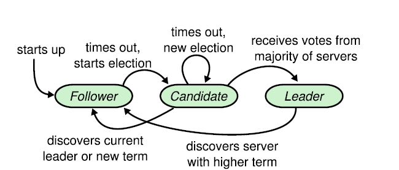
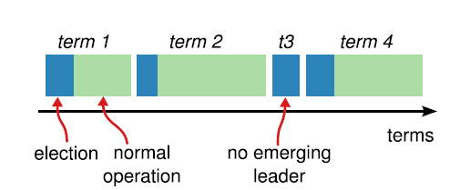
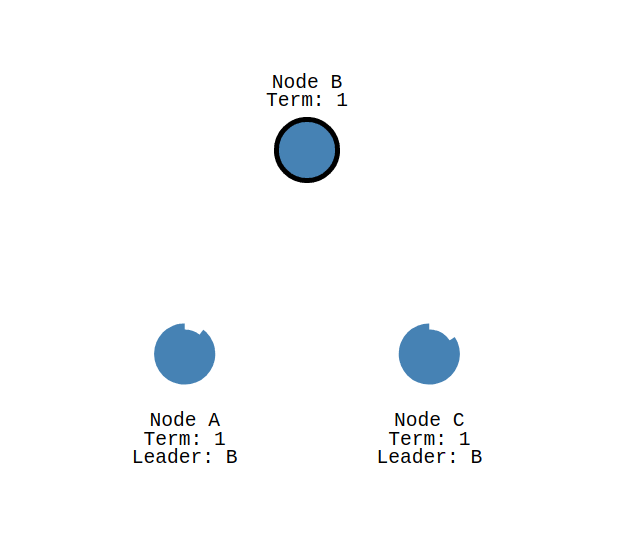

# 分布式一致性算法——Raft算法

上个小节我们介绍了2PC算法，属于CA算法。本小节我们介绍一个属于CP的算法——raft。

一致性算法允许一组机器像一个整体一样工作，即使其中一些机器出现故障也能够继续工作下去，这个特性使得一致性算法一直是产业界研究的热门，在产业界机器故障是需要纳入架构设计中的。

在介绍raft之前需要引入两个概念 —— 状态机和状态机复制。对于我们程序员来说这两个概念在工作中其实非常常见，我们需要明白常见到东西经常会被抽象成模型，因为只有做了这个抽象化的模型后才更好的进行研究。

## 状态机（FSM）

状态机又称有限状态机（finite-state machine 简称FSM），是表示有限个状态以及在这些状态之间的转移和动作等行为的数学计算模型。

状态机被定义为下面这些值元组：
- 一组状态
- 一组输入
- 一组输出
- 一个转换函数（输入 x 状态 → 状态）
- 一个输出函数（输入 x 状态 → 输出）
- 被称为“初始”的一个独特状态

一个状态机从“初始”状态开始，每一个输入都被传入转换函数和输出函数，以生成一个新的状态和输出。在新的输入被接收到前，状态保持不变。

看到这个模型的定义内容我们很容易联想到数据库其实就是一个经典的状态机模型。刚创建的数据库就是一个初始状态，然后接收不同的输入（增，删，改）后根据本身状态计算出新的状态，查询可以理解成输出状态，查询的时候带的函数根据当前的状态计算出新的结果输出。

## 状态机复制

上边介绍了状态机，状态机必须具备确定性：多个相同状态机的拷贝，从同样的“初始”状态开始，经历了相同的输入序列后，会达到同样的状态，并且输出同样的结果，这个过程我们称为状态机复制。

上图中展示了通过日志方式实现的状态机的复制，client通过调用 `Consensus Module`（一致性模块），一致性模块产生相同的日志，然后发给多个状态机，这几个状态机接收相同的日志后，执行得到的状态是一样的。

这个模型我们也应该很快联想到数据库的主从复制，主数据库接收各种输入，然后把这种输入复制一份给从数据库，从数据库就能生成和主数据库一模一样的数据。
在计算机领域，状态机复制是实现容错服务的常见方式。但是在这边我们更关注这个 `Consensus Module`，这个一致性模块就是一致性算法的工作核心——保证复制日志相同。在一台服务器上，一致性模块接收客户端发送来的指令然后增加到自己的日志中。它和其他服务器上的一致性模块进行通信来保证每一个服务器上的日志最终都以相同的顺序包含相同的请求，尽管有些服务器会宕机。一旦指令被正确的复制，每一个服务器的状态机按照日志顺序处理他们，然后输出结果被返回给客户端。因此，服务器集群看起来形成一个高可靠的状态机。

实际系统中使用的一致性算法通常含有以下特性：

- 安全性保证（绝对不会返回一个错误的结果）：在非拜占庭错误情况下，包括网络延迟、分区、丢包、冗余和乱序等错误都可以保证正确。
- 可用性：集群中只要有大多数的机器可运行并且能够相互通信、和客户端通信，就可以保证可用。因此，一个典型的包含 5 个节点的集群可以容忍两个节点的失败。服务器被停止就认为是失败。他们当有稳定的存储的时候可以从状态中恢复回来并重新加入集群。
- 不依赖时序来保证一致性：物理时钟错误或者极端的消息延迟只有在最坏情况下才会导致可用性问题。
- 通常情况下，一条指令可以尽可能快的在集群中大多数节点响应一轮远程过程调用时完成。小部分比较慢的节点不会影响系统整体的性能。

## Raft算法

Raft是一种用来实现`Consensus Module`功能的一种算法。raft通过选举选出一个Leader，然后这个leader复制日志到其他服务器上，在保证安全的时候通知其他服务器将日志应用到状态机上。Leader自己可能宕机，Leader宕机后会新的一轮选举会产生新的Leader。

raft通过Leader的方式可以将一致性问题分解为如下三个问题：
- Leader选举：当现存的Leader宕机的时候,一个新的Leader很快被选举出来。
- 日志复制：Leader必须从客户端接收日志然后复制到集群中的其他节点，并且强制要求其他节点的日志保持和自己相同。
- 安全性：如果有任何的服务器节点已经应用了一个确定的日志条目到它的状态机中，那么其他服务器节点不能在同一个日志索引位置应用一个不同的指令。

### Leader选举

在接收Leader选举前需要看下，raft的节点状态迁移和任期。

####  节点状态
raft节点有三个状态：
- Leader（领导者）
- Follwer（跟随者）
- Candidate（候选人）

在任何时刻，每一个服务器节点都处于这三个状态之一：Leader、 Follwer或者Candidate

每个节点一开始都是Follwer，在一定时间内没有收到Leader发过来的心跳包后，会触发一个timeout，这个时候节点会让自己变成候选者，给集群里头的机器发信息，发起投票。

#### 任期

raft把时间被划分成一个个的任期，每个任期开始都是一次选举。在选举成功后，Leader会管理整个集群直到任期结束。
有时候选举会失败，那么这个任期就会没有Leader而结束。
任期之间的切换可以在不同的时间不同的服务器上观察到。

### Leader选举过程

- 每个节点初始化的时候都是跟随者。
- 领导人维护地方是通过给所有的跟随者发心跳检查实现。
- 跟随者在一定时间内没有收到心跳检测会把自己变成候选者，要求集群里头的节点投票

如上图动画显示，在trem0集群没有Leader，在经过Leader心跳timeout时间后会发生选举，Node B率先发动选举，它的角色由Follwer变成Candidate，这个时候进入trem1，它先给自己投了一票，然后让Node A和Node C投票，投票通过后Node B最为Leader会一直和Node A和Node C 维持心跳。

接下来我们看下Node B节点做为Leader后宕机的情况。

如上图动画显示，B节点宕机后，在一个心跳周期内没有收到心跳包，A节点变成
Candidate，然后任期进入trem2,A节点给自己投票，然后让c节点投票，A变成了Leader。

## 参考文档

http://thesecretlivesofdata.com/raft/